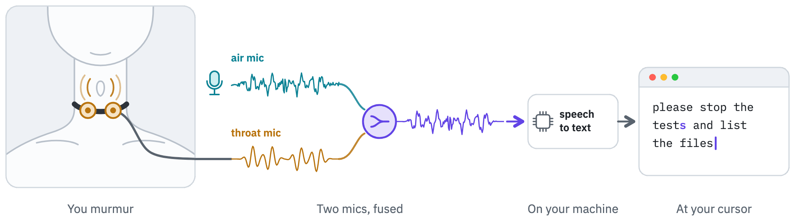
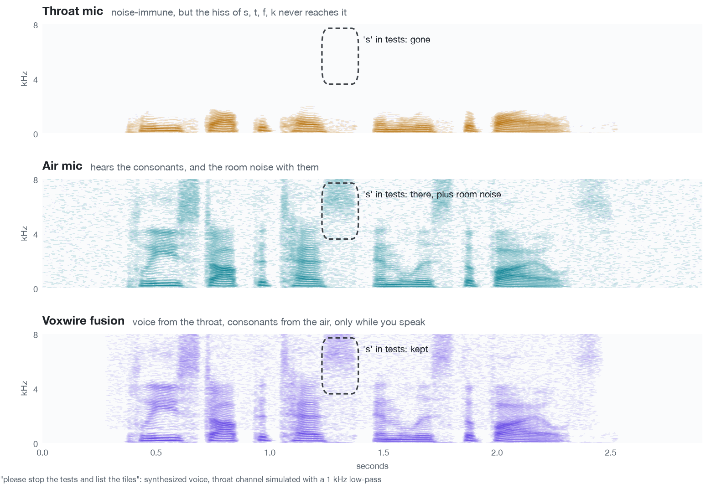
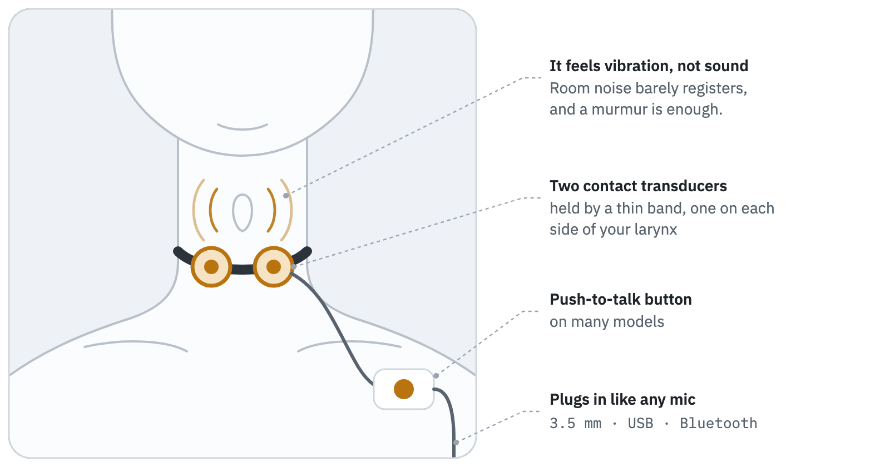
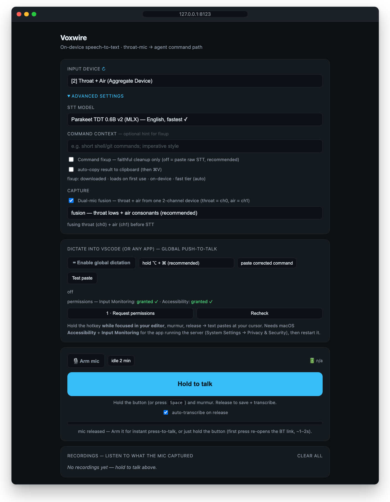
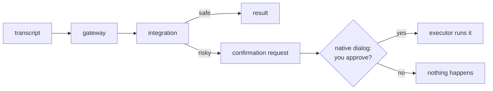
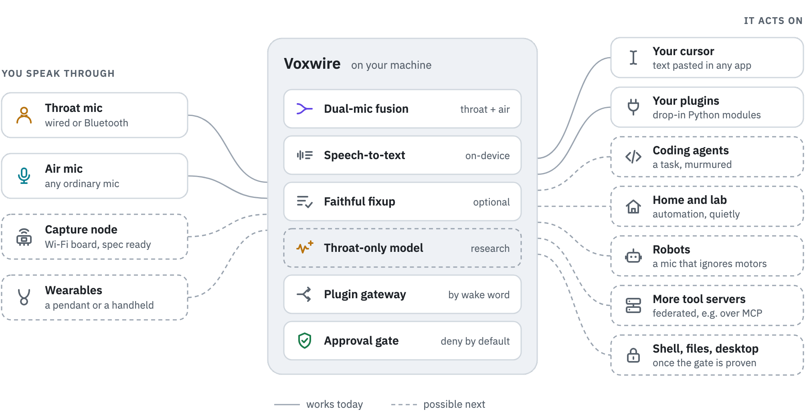

<div align="center">

# Voxwire

**Talk to your computer through a throat mic: quietly, hands-free, and on your own machine.**

[](https://github.com/66mhz/open-voxwire/actions/workflows/ci.yml)
[](LICENSE)
[](pyproject.toml)

</div>

<picture>
  <source media="(prefers-color-scheme: dark)" srcset="docs/images/hero-dark.png">
  
</picture>

## Why Voxwire exists

Talking to your computer works well until you're in an open office, on a call, next to someone
asleep, or in a noisy workshop. A **throat mic** fixes that. It rests against your neck and picks up
your voice through your skin, so you can murmur, room noise stays out, and the people around you
don't hear your commands.

There's a catch, and it's why so little software supports throat mics well: a throat mic hears your
voice but not your mouth. The hiss of **s**, **f**, **t**, **k** and **sh** comes from your lips and
tongue, not your vocal cords, so it never reaches the mic. Speech recognition then stumbles exactly
where commands live: "stop the test" instead of "stop the tests".

<picture>
  <source media="(prefers-color-scheme: dark)" srcset="docs/images/fusion-dark.png">
  
</picture>

<sub>One phrase, three ways, through Voxwire's own fusion code. This is an illustration: a synthesized
voice, with the throat channel simulated by a 1 kHz low-pass. On this clip the on-device recognizer
heard "stop the <b>test</b>" from the throat channel and "stop the <b>tests</b>" from the fused one.</sub>

**Voxwire is built around that gap.** It pairs the throat mic with an ordinary mic and fuses the
two, runs speech recognition on your own machine, lets an optional cleanup pass fix what's still
misheard (and nothing else), and hands the result to tools you connect, behind an approval gate
the agent can't open by itself.

If you only ever dictate at a quiet desk, a normal mic is simpler, and Voxwire works with one too.

## What a throat mic looks like

<picture>
  <source media="(prefers-color-scheme: dark)" srcset="docs/images/throat-mic-dark.png">
  
</picture>

A thin band holds one or two small contact transducers against your throat, on either side of the
larynx. Throat mics are sold for two-way radios, motorcycle helmets, airsoft and gaming, and the
[idea is old](https://en.wikipedia.org/wiki/Throat_microphone): Second World War aircrews used them
to talk over engine noise.

<table>
<tr>
<td align="center" valign="top">
<br>
<sub>A throat mic for two-way radios, with a push-to-talk puck.<br>
<a href="https://commons.wikimedia.org/wiki/File:Throat_Microphone._Out_of_the_package..jpg">"Throat Microphone. Out of the package."</a>
by Jshin722, <a href="https://creativecommons.org/licenses/by-sa/3.0/">CC BY-SA 3.0</a></sub>
</td>
</tr>
</table>

A few you can find today. They're examples, not endorsements, and we haven't tried them all with
Voxwire:

| Throat mic | Connects by | What it's like |
|---|---|---|
| [EarHugger Throat Microphone](https://earhugger.com/product/throat-microphone/throat-microphone-for-cell-phone/) | 3.5 mm headset plug | One transducer on a padded neck grip, and an earpiece tube. No push-to-talk. |
| [IASUS NT5](https://iasus-concepts.com/product/nt5-throat-mic/) | 3.5 mm or USB-C cable, picked when you buy | An elastic strap with one transducer module and a breakaway clasp. Push-to-talk is optional. |
| [IASUS STEALTH Bluetooth](https://iasus-concepts.com/product/stealth-bluetooth-throat-mic-xsound-3/) | Bluetooth | A wireless neckband with a magnetic clasp. This bundle adds helmet speakers. |
| Radio throat mics, such as the [Code Red Assault-MOD](https://coderedheadsets.com/assault-mod-tactical-throat-mic-headset/) | a radio plug, such as Kenwood 2-pin | Two transducers, a big push-to-talk puck and an earpiece. A computer needs an adapter cable. |
| The WWII [T-30](https://airandspace.si.edu/collection-objects/microphone-throat-type-t-30-q-united-states-army-air-forces/nasm_A19751417000) (Smithsonian) | historical | The US Army Air Forces aircrew mic: black rubber on a brown elastic strap. |
| A DIY [contact mic](https://en.wikipedia.org/wiki/Contact_microphone) | a mic input, through a preamp | A piezo disc against your throat. It needs a high-impedance buffer, which the [capture node spec](docs/capture-node.md) includes. |

**Which one for Voxwire?** Any throat mic your computer sees as a microphone works for dictation
and throat-only (stealth) mode. Dual-mic fusion needs both mics as one 2-channel input, so the easy
route is a wired throat mic and an air mic on a 2-channel USB audio interface. A Bluetooth mic keeps
its own clock and delay, and computers usually record Bluetooth headset mics at 8 or 16 kHz, so
it's best kept for throat-only mode.

## What makes it different

<table>
<tr>
<td width="50%" valign="top">


**Built for the throat mic.** Dual-mic fusion keeps the throat mic's noise immunity below 900 Hz
and borrows the consonants from an air mic above it, only while you're speaking.

</td>
<td width="50%" valign="top">


**Runs on your machine.** Speech-to-text is local: MLX (Whisper, Parakeet) on Apple Silicon,
faster-whisper on Windows, Linux and Intel Macs. Your audio doesn't have to leave the device.

</td>
</tr>
<tr>
<td valign="top">


**Faithful, not creative.** The optional LLM cleanup may only fix mishearings. A structural check
keeps a reply only if every changed word is a plausible mishearing, with nothing added or dropped.
It's off by default.

</td>
<td valign="top">


**Safe to wire up.** The agent can't approve its own risky actions: approval belongs to the
executor and is denied by default. Tools that touch your shell, files or desktop stay off until a
confirm dialog that rejects synthetic clicks is built and proven on your OS.

</td>
</tr>
<tr>
<td valign="top">


**Plugins, not hardcode.** Integrations, speech engines and model tiers are all swappable. An
integration is a drop-in module, or a separate package that declares it.

</td>
<td valign="top">


**Always there.** A menubar app on macOS that starts at login, or a tray app on Windows and Linux,
plus a web config at `127.0.0.1:8123`.

</td>
</tr>
</table>

## How it works

1. **Capture.** Hold the hotkey and murmur. Voxwire records the throat mic, and the air mic too
   when both come in as one 2-channel input.
2. **Fuse.** The two mics become one clean signal (below).
3. **Transcribe.** A local speech model turns it into text.
4. **Clean up** *(optional)*. A faithful pass fixes mis-heard words, and only those.
5. **Act.** The text is pasted at your cursor, or routed to an integration. Anything risky waits
   for you.

### Dual-mic fusion

<picture>
  <source media="(prefers-color-scheme: dark)" srcset="docs/images/fusion-diagram-dark.png">
  
</picture>

The throat mic carries the low band, where your voice lives and room noise can't reach. The air mic
fills in the consonants above the crossover, but only while the throat mic says you're speaking, so
the room stays out of the pauses around what you say. The gate opens 150 ms before your voice and
holds 200 ms after, because sounds like the *s* in "stop" sit just outside the voiced part. The same
hold bridges the short gaps between words, so within a phrase the air mic's highs come through, room
noise and all. Three modes ship: **fusion**, **throat-only** (stealth) and **air-only**.

Fusion needs both mics on one 2-channel input device, such as a USB audio interface, or a macOS
Aggregate Device with the throat mic on channel 0 and the air mic on channel 1, so both mics share
one clock. Capturing from two separate devices is still in build-out.

## Quickstart

```bash
git clone https://github.com/66mhz/open-voxwire && cd open-voxwire
./scripts/install.sh          # creates the environment, installs dependencies
```

Then either:

```bash
cd voxwire && ./run.sh app    # menubar app (macOS) or tray app (Windows/Linux)
# or
cd voxwire && ./run.sh        # headless server + web config at http://127.0.0.1:8123
```

Hold the hotkey (default **⌥ + ⌘**), murmur, release. Voxwire transcribes locally and pastes at
your cursor. The first time, macOS asks for **Microphone**, **Accessibility** and **Input
Monitoring**; grant them to the venv's `python`.

<p align="center">
  
</p>

<details>
<summary><b>Keep it running at login (macOS)</b></summary>

macOS uses launchd, so Voxwire installs as a per-user LaunchAgent. It starts at login and restarts
if it crashes, and you arm the mic when you need it.

```bash
./scripts/service-macos.sh install              # menubar app, always-on (default)
./scripts/service-macos.sh install --headless   # server only, e.g. on a headless Mac
./scripts/service-macos.sh status               # is it loaded? is Voxwire answering on :8123?
./scripts/service-macos.sh restart              # relaunch, also after a clean Quit
./scripts/service-macos.sh logs                 # tail the log (owner-only, rotated past 10 MB)
./scripts/service-macos.sh uninstall
```

`install` also retires the older `io.voxwire.agent` job that `scripts/service.sh` used to create,
so an upgrade doesn't leave two copies starting at login. Always-on for Linux or a Raspberry Pi
isn't packaged yet.

</details>

## Status

Voxwire is early software.

**Works today**
- Local dictation: throat or regular mic, on-device speech-to-text, paste at the cursor
- Pluggable speech-to-text backends (MLX on Apple Silicon, faster-whisper elsewhere)
- Dual-mic fusion from a 2-channel device, and network PCM input for a capture node (local
  connections only)
- Optional faithful fixup, with the structural check above
- The generic plugin gateway, including plugins from outside the repo
- Menubar and web UIs that stay in sync, and an always-on macOS service

**In progress**
- Measuring fusion's word-error rate on real throat-mic recordings
- Throat-only enhancement for stealth mode
- Executor tools (shell, files, desktop) behind a confirm dialog that rejects synthetic input
- An authenticated LAN listener for a Wi-Fi capture node
- A bundled Voxwire.app and a docker-compose setup

## Security

An always-on mic that can run commands is a real attack surface, so Voxwire's security is
structural, not a prompt. Only the executor can approve a risky action:



- The gateway and the agent can't approve anything. Approval happens in a native dialog owned by the
  executor host.
- Executor tools stay **off on every OS** until that dialog provably rejects synthetic input, which
  isn't built yet. So today Voxwire can't run shell commands, edit files or drive your desktop.
- `/api/audio-stream` accepts only connections from this machine, and refuses web pages other than
  Voxwire's own.
- The menubar **kill switch** releases the mic and turns dictation off. It doesn't stop the server.

See [SECURITY.md](SECURITY.md) for the threat model and how to report a vulnerability privately.

## Make it yours

- **Integrations:** copy [`voxwire/integrations/echo.py`](voxwire/integrations/echo.py), change the
  wake words and `handle()`, and it's live. From outside the repo, declare it in the
  `voxwire.integrations` entry-point group of your own package, or point `VOXWIRE_PLUGIN_PATH` at
  a folder of plugin modules.
- **Speech engines:** implement `is_available` and `transcribe` in a backend under
  [`voxwire/stt/`](voxwire/stt/).
- **Models:** every model ID lives in one table: [`voxwire/tiers.py`](voxwire/tiers.py) for LLMs and
  [`voxwire/stt/models.py`](voxwire/stt/models.py) for speech. Point `STT_LLM_BASE_URL` at any
  OpenAI-compatible endpoint to use your own LLM for the cleanup.

## Future directions

<picture>
  <source media="(prefers-color-scheme: dark)" srcset="docs/images/future-dark.png">
  
</picture>

Under the hood, Voxwire is a quiet voice channel into a machine you control, with a gate in front
of anything risky. That could enable a lot more than dictation. None of the following ships today;
each is a plugin, a board or a model away:

- **Coding agents.** Murmur a task to a coding agent without reaching for the keyboard. Any risky
  step would wait at the gate.
- **Hands-busy, noisy work.** In a workshop, a lab or out in the field, the throat mic barely hears
  the noise around you, and a plugin could log a reading or pull up a manual.
- **Home and lab automation.** A plugin for Home Assistant or MQTT could run a scene or a machine
  without waking the house.
- **Robots.** Robots are loud, and a throat mic mostly ignores airborne noise, so it could carry
  your commands over the sound of the motors. An on-robot capture node is planned.
- **Wearables.** The Wi-Fi capture node, one small board that streams the throat and air mics on a
  shared clock, has a [build spec](docs/capture-node.md). A pendant such as Omi, or a handheld
  such as the rabbit r1, could also send requests to your own Voxwire host.
- **Accessibility.** A private, local voice path for people who find typing painful or can only
  speak quietly. Nobody has tested Voxwire for this yet.
- **More tools, same gate.** Federation across tool servers (MCP, for example), and shell, file and
  desktop tools once the confirm dialog provably rejects synthetic input.
- **Throat-only accuracy.** A model that restores the consonants from the throat channel alone
  would make stealth mode as accurate as fusion. Training it needs paired throat and air
  recordings, which the capture node is designed to collect.

Want to build one of these? Most start as a plugin: see [Make it yours](#make-it-yours) and
[CONTRIBUTING.md](CONTRIBUTING.md).

## Documentation

- [Design](docs/DESIGN.md): architecture, security model, roadmap
- [Inside Voxwire](docs/how-voxwire-works.html): an illustrated walkthrough (download it and open it
  in a browser)
- [Capture node](docs/capture-node.md): hardware build spec for a throat + air mic streamer
- [Contributing](CONTRIBUTING.md) and [Security](SECURITY.md)

## License

MIT. See [LICENSE](LICENSE).
