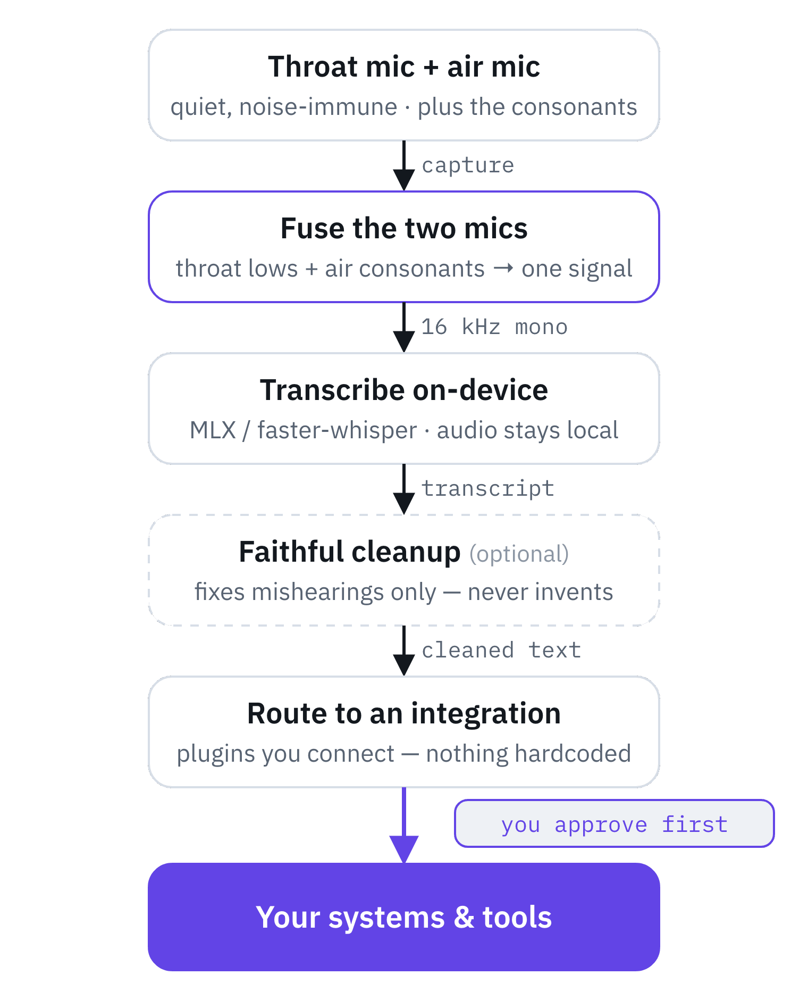
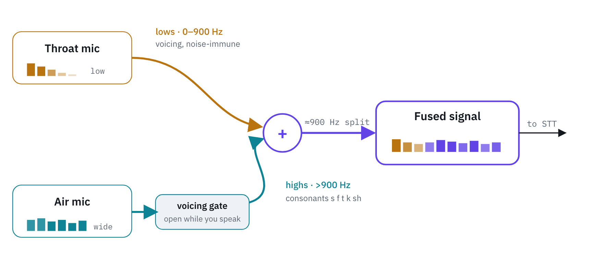

# Voxwire — Design

Voxwire exists because a throat mic is the best microphone for quiet, hands-free
voice control, and the worst one for speech recognition: it hears your voice but not
the consonants your mouth makes. The README shows the gap and the fix
([one phrase, three ways](../README.md)); this document is how the system is built
around it.

Two goals shape every decision: **flexibility** (bring your own mics, models, and
tools) and **single-click deployment** (one install, one launch).

<picture>
  <source media="(prefers-color-scheme: dark)" srcset="images/pipeline-dark.png">
  
</picture>

## 1. Throat-mic-native input (the differentiator)

A throat/contact mic is band-limited — it loses high-frequency consonants. Voxwire
handles this in three layers, used according to mode:

<picture>
  <source media="(prefers-color-scheme: dark)" srcset="images/fusion-diagram-dark.png">
  
</picture>

- **Dual-mic fusion** (throat + air) — *implemented* (`voxwire/fusion.py`): a
  spectral band-merge takes the low/voicing band from the throat (noise-immune)
  and the consonant band from the air mic, gated by the throat's voicing envelope
  so the air's room noise only passes while you speak. The gate opens 150 ms
  before voicing and holds 200 ms after it, because unvoiced consonants
  (/s/ /f/ /t/ /k/) sit right next to voicing but carry almost no throat
  energy; fusion runs on whole clips, so the look-ahead is free. Modes: fusion / throat-solo
  (stealth) / air-solo. Capture: a single 2-channel device (throat = ch0, air =
  ch1, e.g. a macOS Aggregate Device) is sample-aligned by a shared clock; two
  separate devices are time-aligned by envelope cross-correlation (`align()`),
  which is exact enough for short push-to-talk utterances.
- **Enhancement** (throat only / stealth mode): reconstruct the missing band before
  STT. Prior art to draw on: GMM and neural throat→wideband mapping. Fusion
  conveniently produces the paired throat+air data this needs. *(in build-out)*
- **Intent-first decoding**: command-constrained decoding + a *faithful* LLM cleanup
  (fix mishearings, never invent) so degraded audio still yields the right command.
  Faithfulness is enforced structurally, not just prompted: `voxwire/faithful.py`
  aligns the reply word-for-word with the transcript and accepts it only if every
  changed word is a close spelling of the heard one (restored consonants, a letter
  or two off, re-spacing). Any added, dropped, or swapped-in word keeps the raw
  transcript. Known limit: a close-spelled word can still flip meaning ("not" →
  "now"), which is why fixup stays off by default and gated actions still confirm.

STT is local, and the engine is a **pluggable backend** (`voxwire/stt/`), chosen
per machine so the same code runs everywhere: MLX Whisper / Parakeet on Apple
Silicon, and faster-whisper (CTranslate2, CPU or CUDA) on Windows, Linux, and
Intel Macs. Model IDs live in one registry (`stt/models.py`), each naming its
backend; the server never imports a platform STT runtime. Audio need not leave
the device.

## 2. Flexibility — plugins, not hardcode

- **Bring your own model.** The router speaks OpenAI- and Anthropic-compatible APIs.
  A model ID appears in exactly ONE config table (`voxwire/tiers.py`: `fast` |
  `heavy` | `cloud`; the transcript fixup uses `fast`); nothing else names a model,
  and a test enforces it. Add a local `llama.cpp`/Ollama tier or a cloud model
  without touching the core. A remote endpoint's model comes from `STT_LLM_MODEL`
  or the first chat model in the endpoint's own `/models` list (embedding/speech/
  image ids are skipped; a list with none fails clearly), never a made-up name.
- **Bring your own tools/integrations.** An *integration* is a drop-in plugin
  (`voxwire/integrations/base.py`): it declares how it is triggered and what it does.
  Register it and it's live, whether it sits in `voxwire/integrations/`, in an
  installed package's `voxwire.integrations` entry points, or in a folder named by
  `VOXWIRE_PLUGIN_PATH`. Slack, home automation, a CI trigger, your own service —
  each is an integration, none is baked into the gateway.
- **Bring your own STT.** A speech-to-text *backend* is a plugin too
  (`voxwire/stt/base.py`): implement `is_available` + `transcribe`, register it, and
  it's selectable. MLX and faster-whisper ship in-tree; whisper.cpp, an ONNX model,
  or a cloud STT is a drop-in — the core only ever calls `stt.transcribe(...)`.
- **Executors** are how the agent touches a machine: shell, files, and desktop
  control, exposed as a small tool contract per host. Capability is scoped per host
  and per persona; destructive actions are gated (below).

## 3. Security — structural, not prompt-based

Because an always-on mic that can run commands is a real attack surface:

- **Confirmation is owned by the executor, not the agent.** A destructive tool
  returns a single-use, argument-bound confirmation request; the user approves it via
  a **native dialog that rejects synthetic input** — the agent cannot click its own
  Approve.
- **Capability = scope ∩ host tier**, computed in one place, deny-by-default.
- **Append-only audit log** of every attempt (ask / deny / do), and a **kill switch**
  that works without routing through the agent.
- **The confirm gate is per-OS and deny-by-default.** It lives behind the platform
  layer (`osplatform.confirm` / `executor_gate_ready`, §4). A backend enables the
  executor *only* where a native dialog that rejects synthetic input is proven;
  everywhere else `executor_gate_ready()` is False and `confirm()` returns False,
  so the executor is **structurally disabled** on that OS. Today that is *every*
  OS: macOS's NSAlert works as the human-facing primitive but does not yet reject
  synthetic input (Epic 2 / R1), and Windows/Linux have no proven gate — so no
  executor path is enabled anywhere. Hardening a per-OS gate is a separate,
  human-reviewed task; a gate is never weakened to make a feature work.
- **Only this machine, and only Voxwire's own page, reach the server.** The server
  has no authentication, so one ASGI middleware (`LocalOnly` in `server.py`) sits
  in front of every route, HTTP and WebSocket. A request must come from a loopback
  peer, name a loopback host (`127.0.0.1`, `localhost`, `::1`), and, if a browser
  sent it, carry Voxwire's own page as its Origin. Anything else gets a 403 before
  a route runs. This stops other web pages from driving the API (CSRF) and from
  reaching it through DNS rebinding, and stops the network if the server is ever
  bound wider than loopback. A route added later is covered by default.

Start with dictation only; grant executor tools deliberately.

## 4. Single-click deployment

- `./scripts/install.sh` — creates the environment and installs dependencies.
- `./run.sh app` — the native app that runs the server in-process: the **rumps
  menubar** on macOS, the **pystray system tray** on Windows/Linux (same server,
  same HTTP API; the tray drives it over `http://127.0.0.1:8123` exactly as the
  menubar does — no server internals are imported).
- `./run.sh` — headless server + web config, on any OS.
- `./scripts/service-macos.sh install` — **always-on autostart (macOS)**: a
  per-user launchd LaunchAgent that starts Voxwire at login and relaunches it if
  it *crashes* (`KeepAlive → SuccessfulExit=false`, throttled), so the server is
  reachable on `:8123` 24/7. `install --headless` runs the server alone (no
  menubar) for a headless Mac mini. A clean Quit stays quit; `restart` brings it
  back. It's a GUI (Aqua) agent, not a system daemon — the native confirm gate
  and the global dictation hotkey need a logged-in session — so it does not run
  at the login window or for other users. `uninstall` / `status` (checks the
  agent *and* curls `:8123`) / `logs` round it out. The log
  (`~/Library/Logs/voxwire.log`) can hold transcripts, so it is owner-only
  (0600) and rotated to `voxwire.log.1` past 10 MB on `install` / `restart`. On Windows/Linux, autostart
  the tray app from the session's own autostart (systemd user unit / Startup) —
  a follow-up.
- Roadmap: a bundled `Voxwire.app` (py2app) so permissions attach to the app, and a
  `docker-compose` for running the agent service on a Pi or a server.

**The server never depends on the mic.** Arming/releasing the throat mic only
opens or closes a PortAudio input stream; the FastAPI process stays up whether
the stealth mic is connected or not. If a *warm* mic's device vanishes mid-arm
(a Bluetooth throat mic drops), the idle watcher detects the dead stream — a
CoreAudio query that reports inactive or raises — and reaps it so PortAudio can
re-init and the mic re-arms cleanly when it returns; `ensure_warm` likewise
rebuilds a dead stream on the next arm. None of this can take the server down.

### Platform layer (`voxwire/osplatform/`)

The OS-native things dictation needs — put text on the clipboard, paste it into
the frontmost app, report/request the permissions that requires, and the confirm
gate — live behind one **runtime-selected platform layer**, so the same code runs
on macOS, Windows, and Linux (X11 first). It mirrors `stt/`: a tiny interface +
registry (`osplatform/base.py`), one backend per OS (`macos.py` / `windows.py` /
`linux.py`) chosen from `sys.platform`, and **every OS-native import kept lazy**,
so importing any backend module on the "wrong" OS is harmless. The core only ever
calls `osplatform.paste_text(...)`, `osplatform.check_perms()`, etc. — it never
names an OS. The paste chord differs per OS (Command+V on macOS, Control+V
elsewhere); clipboard uses `pbcopy` / `clip` / `wl-copy`·`xclip`, with a
`pyperclip` fallback, and degrades gracefully (returns False, leaving the text on
the clipboard) when the tooling is absent.

> The package is `osplatform`, **not** `platform`: `voxwire/` is a `sys.path`
> root, so a top-level `platform` package would shadow the stdlib `platform`
> module that `stt/mlx_backend.py` imports — silently breaking MLX availability
> detection on Apple Silicon.

The confirm primitive is defined here but stays **deny-by-default** (§3): macOS's
native NSAlert remains the human-facing dialog in the menubar (unchanged), and
Windows/Linux report the gate as unsupported. No executor path is enabled on any
OS until a per-OS, synthetic-input-rejecting gate is built and human-reviewed.

## Public core ↔ private instance

Voxwire (public) is consumed as a **dependency**. A private instance installs the
**unmodified** public package and layers its own integrations, personas, and config
on top through the plugin API — it never edits the public core. This keeps the two
from diverging: the public core stays generic, the private surface stays private,
and there is one source of truth for the core.

- **Install:** an editable install of a Voxwire checkout,
  `pip install -e /path/to/voxwire`. A built wheel isn't usable yet (it doesn't
  carry the web UI, and the flat module layout would land names like `server`
  at the top of site-packages); that waits on the move to a real `voxwire.*`
  package.
- **Add integrations** without touching the core, in either of two ways that
  `gateway.load_integrations()` picks up next to the built-in plugins:
  - an installed overlay package declares them in the `voxwire.integrations`
    entry-point group (a module that calls `register(...)`, an `Integration`
    instance, or an `Integration` subclass), e.g.
    `[project.entry-points."voxwire.integrations"] chatops = "overlay.chatops"`;
  - or `VOXWIRE_PLUGIN_PATH` names folders of plugin modules
    (`os.pathsep`-separated), for an overlay that isn't packaged.

  Plugins run in-process with your privileges, so only load code you trust. An
  outside plugin that fails to load (any exception, `SystemExit` included; only
  Ctrl-C propagates) is skipped, and anything it registered before failing is
  rolled back, so a skipped plugin never receives commands. It is listed under
  `errors` in `GET /api/integrations` by file / entry-point name and exception
  type only; the full message, which may hold a token or internal host name, goes
  to the local log.

## Status / roadmap

**Working today**

- The local dictation loop: throat or regular mic → on-device STT → paste.
- The **pluggable STT layer** (`stt/`): MLX on Apple Silicon, faster-whisper on
  Windows, Linux and Intel Macs, selected per machine.
- **Dual-mic fusion** (`fusion.py`): throat + air band-merge with a voicing gate that
  holds around voicing, from a sample-aligned 2-channel device; plus network PCM
  input for a capture node (local connections only).
- The **faithful fixup**, optional and off by default, with the structural guard in
  `faithful.py`.
- The generic **gateway/plugin router** (`gateway.py`: transcript → `route(Command)` →
  integration `.handle()`), loading plugins from `integrations/`, from installed
  packages' `voxwire.integrations` entry points, and from `VOXWIRE_PLUGIN_PATH`.
- The **cross-platform platform layer** (`osplatform/`): clipboard, paste, permissions
  and the confirm primitive per OS, with the rumps menubar on macOS and the pystray
  tray elsewhere. The executor confirm gate is deny-by-default on every OS.
- Server-authoritative settings that the menubar and web UI both reflect, and an
  always-on macOS LaunchAgent.

**In build-out**

- Measuring fused vs throat-solo word-error rate on real recordings
  (`scripts/fusion_eval.py`; protocol in [fusion-eval.md](fusion-eval.md)).
- Two-separate-device live capture (the `align()` primitive exists).
- The throat-only enhancement model.
- The persona/executor security model, including a per-OS confirm gate that rejects
  synthetic input.
- Multi-server tool federation.
- Packaging: a real `voxwire.*` package, a bundled Voxwire.app, and docker-compose.

**Hardware companion (roadmap):** the cleanest capture is one board digitizing
throat + air on a 2-channel ADC and streaming PCM to the host over Wi-Fi — one
clock (no drift), full bandwidth (no Bluetooth HFP narrowband). The host side
exists: `/api/audio-stream` takes streamed PCM as an ordinary Voxwire input. It
refuses browser pages other than Voxwire's own (a WebSocket gets no CORS
protection, and the endpoint can paste text) and refuses any peer that is not on
this machine, whatever address the server is bound to (the server itself listens
on loopback only); a node on Wi-Fi needs an authenticated LAN listener, which is
not built yet. Build spec:
`docs/capture-node.md`.
